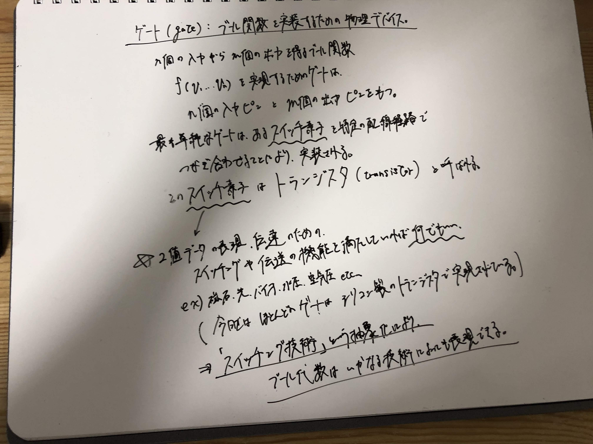
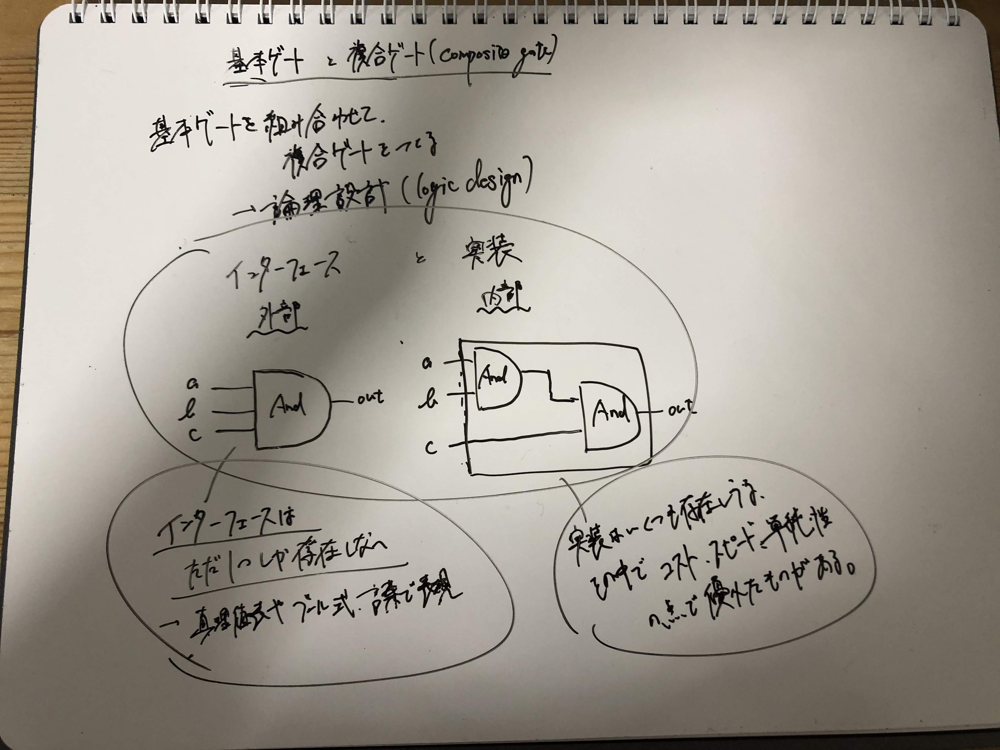
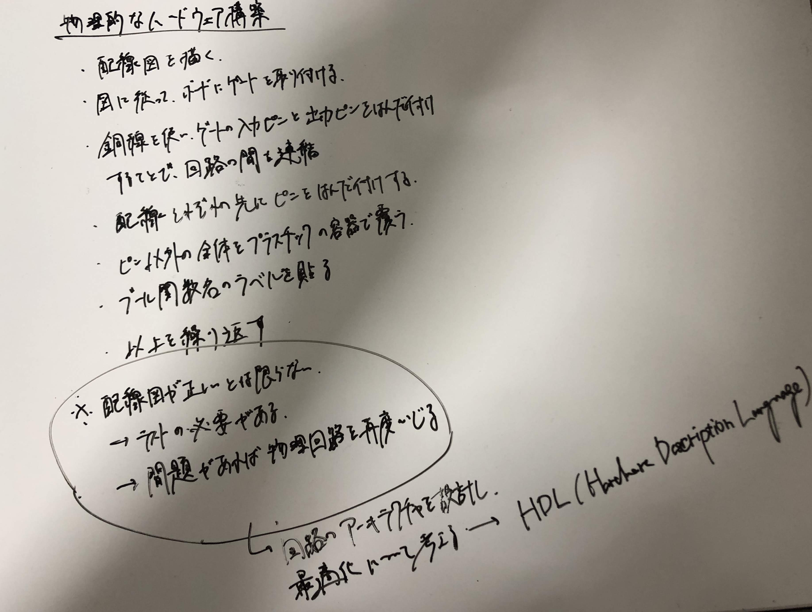
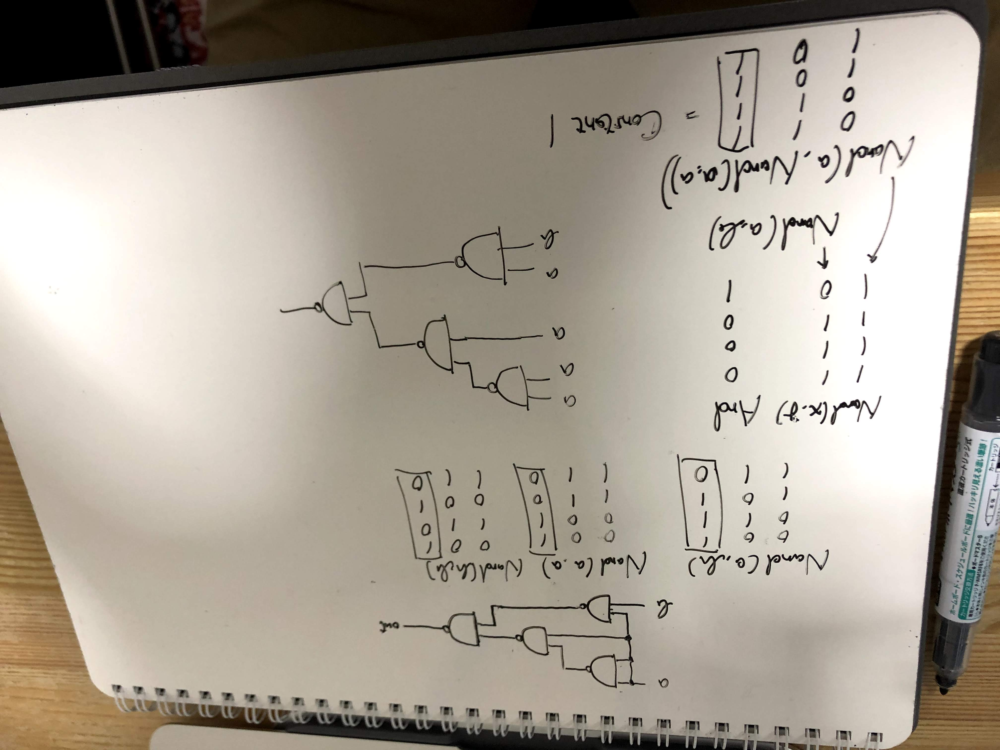
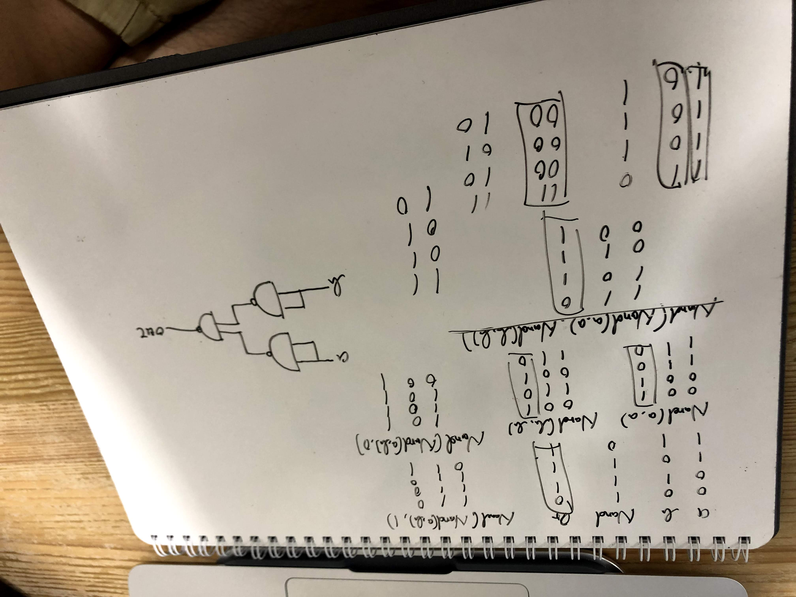
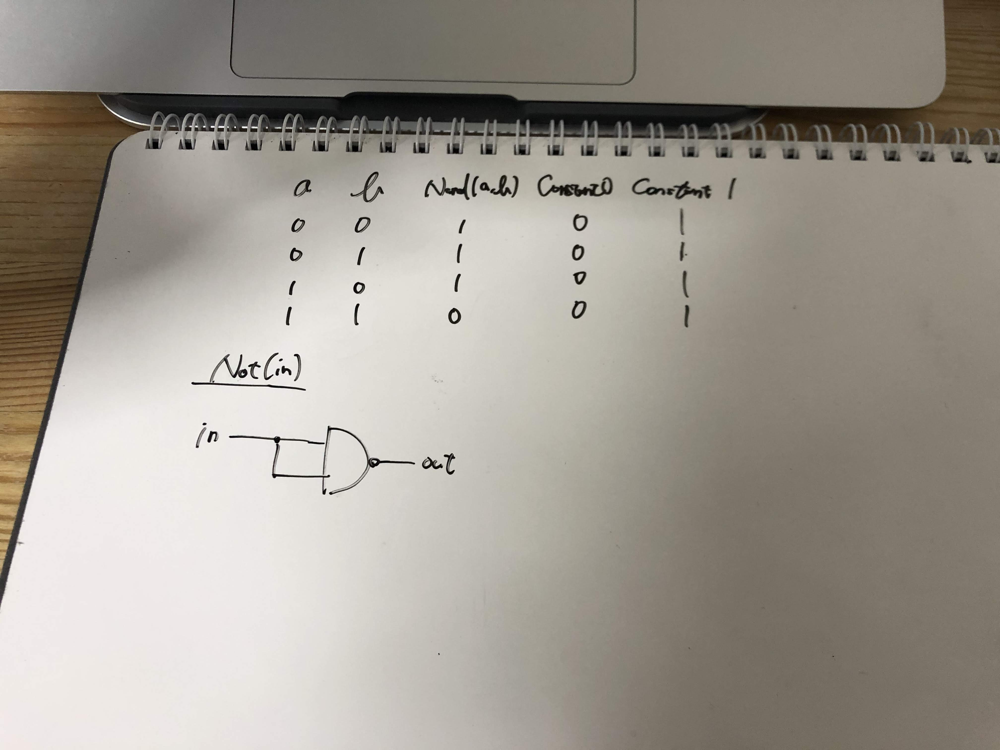
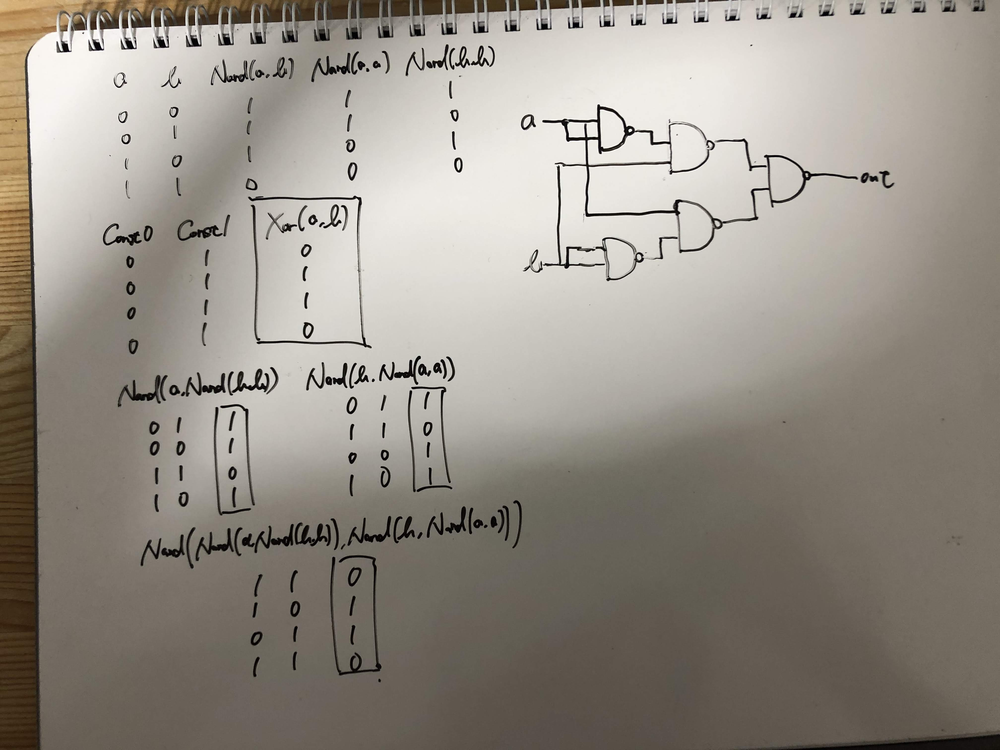
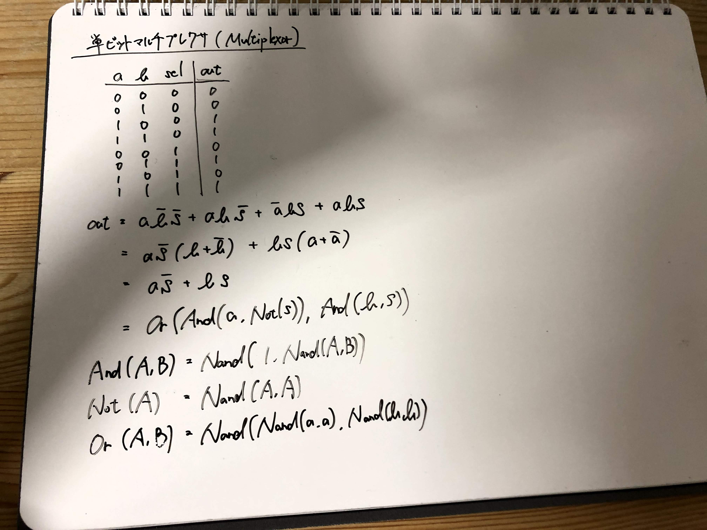
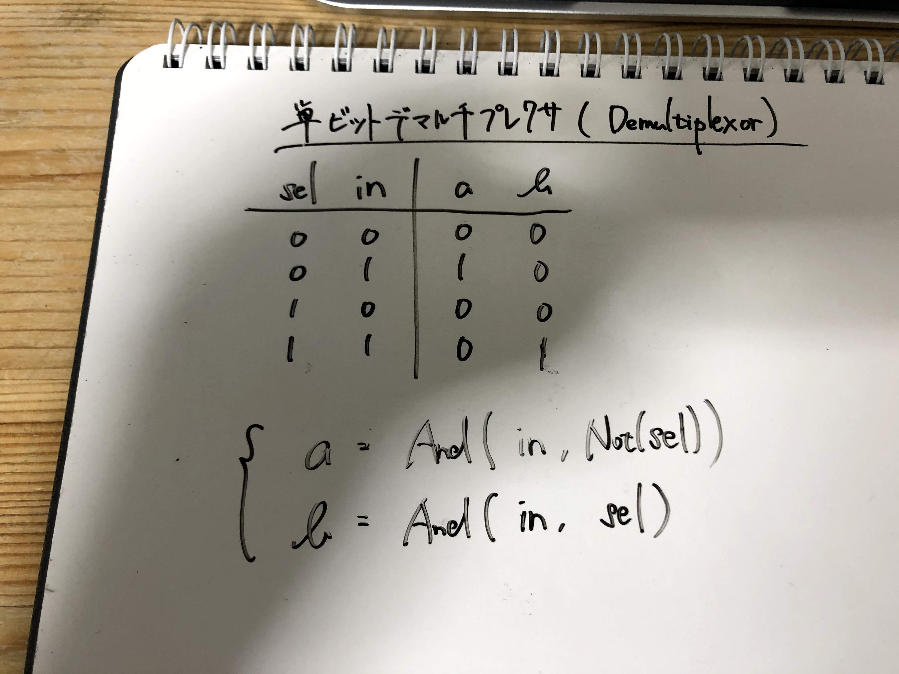

# TheElementOfComputingSystem

「コンピュータシステムの理論と実装」を読んでコンピュータの仕組みを学ぶ。

## 意図

コンピュータシステムの仕組みを深く理解したい。

それによって得た知識や経験を、趣味や業務の中でのシステムの設計・実装・運用・改善に活かしたい。

また、PCのハードウェアやOSやプログラミング言語を自分で作れるようになるための知識の土台として本書を活かしたい。

# 備忘録

## まえがき

コンピュータシステムの仕組みを理解するには、コンピュータをゼロから作り上げるのが最良の手段である。

本書の構成。

- 1〜5章 ハードウェア
  - 1章 ブール論理
  - 2章 ブール演算、ALU
  - 3章 順序論理、メモリ
  - 4章 機械語
  - 5章 コンピュータアーキテクチャ
- 6〜12章 ソフトウェア
  - 6章 アセンブラ
  - 7,8章 バーチャルマシン
  - 9章 高水準言語、アプリケーション
  - 10,11章 コンパイラ
  - 12章 オペレーティングシステム

***

## イントロダクション

本書で学ぶこと。

1. コンピュータの動く仕組み
2. 複雑な問題を扱いやすいモジュールに分割する方法
3. ハードウェアとソフトウェアからなる巨大なシステムを開発する方法

現代のコンピュータシステムは巨大な氷山のようなものであり、それを扱う大多数の人のもつコンピュータの知識は極めて表面的である。

その表層の下に隠れている世界を熟知しているかどうかが「平凡なプログラマー」と「優れた技術者」を分ける試金石となる。

コンピュータに関する深い理解を得るための最も良い方法は、完全なるコンピュータシステムをゼロから構築することである。

論理ゲートを出発点としてコンピュータシステムをゼロから構築する、という複雑な作業には「抽象化」が必要である。

コンピュータサイエンスにおける「抽象化（あるいはインターフェース）」とは、「この要素は何をするのか（What）」（ユーザーが必要とする情報）のみを考え、「それをどのように行うのか（How）」（ユーザーにとって意味のない情報）については無視するということである。

「抽象化」によって、我々はコンピュータシステムを、互いに関係性を持ちながらにして各々について独立して考えることのできる「モジュール」に階層的に分割することができる。

そのようなモジュールのレイヤが多層に重なっていくほどにシステムの能力も高まる。

コンピュータシステムを支えるインターフェースの集合体は

- トップダウン: 上位レベルの抽象から、より単純な抽象へと下っていく
- ボトムアップ: 下位レベルの抽象から、より複雑な抽象へと上っていく

のどちらによっても全体を捉えることができる。

***

## 第1章 ブール論理

(2020-05-28 Thu)
